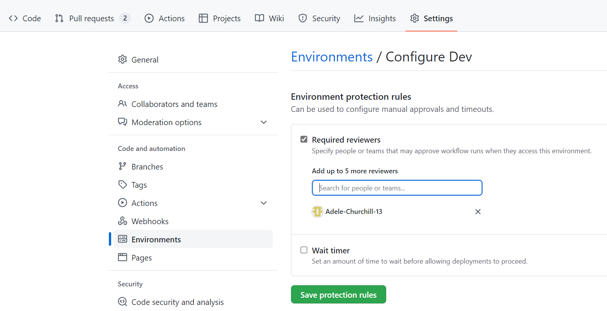
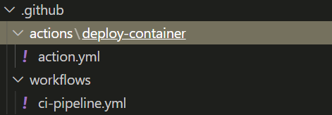

# Introduction

This document outlines what we learnt in the spike [Cross: Github Actions [Spike]](https://github.com/buerokratt/Cross-functional-requirements/issues/1)

## Investigate multi-stage deployment pipelines using Actions

Multi-stage deployment is possible in GitHub by using named jobs such as `dev`, `staging`, `production` etc.


To enable peer reviewing of jobs/stages we can use environments, to set this up requires creating the environment:

1. Going to the repository settings
2. Selecting `Environments` on the left
3. Creating a new environment
4. Selecting `Required reviewers` and entering the usernames or teams of reviewers

5. In the YAML file use the `environment` keyword to sepecify the name of the environment (exact spelling necessary)
    ```
    deploydev:
      runs-on: ubuntu-latest
      environment: Dev
    ```


## Secret handling and configuration in CI/CD

GitHub has its own secrets repository which can operate at both the repository and organisational level.


These secrets can be accessed via the following steps:
1. The `settings` tab of the main page of the repository/organisation
2. On the left selecting `Secrets`
3. Select `Actions`

### Repository Level
- Anyone with collaborator access to the repository can use the secrets for Actions


### Organisation Level
- Can be used with access policies to control which repositories can use organisation secrets
- Share secrets between multiple repositories, which reduces the need for creating duplicate secrets

### Accessing Secrets in Actions
To make a secret available to an action, you must set the secret as an input or environment variable in the workflow file.

```
steps:
  - name: Hello world action
    with: # Set the secret as an input
      super_secret: ${{ secrets.SuperSecret }}
    env: # Or as an environment variable
      super_secret: ${{ secrets.SuperSecret }}
```

[GitHub Documentation on Encrypted Secrets](https://docs.github.com/en/actions/security-guides/encrypted-secrets)

## Versioning in CI pipelines (code based and container based)

If we wish to drive our versions from GitHub Pipeline builds the variable ```github.run_number``` gives us the specific build which created the artifact.

So we'd simply tag the container with a version number when pushing it up to a repository as as follows:
  
```
- name: Build and push
  uses: docker/build-push-action@v3
  with:
    file: ${{ inputs.container-path }}
    context: ${{ inputs.container-context }}
    push: true
    tags: |
      ghcr.io/organisation/container-name:latest
      ghcr.io/organisation/container-name:1.0.${{github.run_number}} 
```
Breaking changes would require changes to the pipeline to increment the major or minor version number, or store that value in a variable.  

If we wanted to version the assemblies, we could simply modify the application code in the pipeline to specify this value and _then_ build the code.

## Workflows calling other workflows with parameters

This can be done using [Composite Actions](https://github.blog/changelog/2021-08-25-github-actions-reduce-duplication-with-action-composition/)

Actions should be located in a `.github/actions` folder

  

Each action must:
- Be in a named directory in the actions folder and contain one file called `action.yml`
- Have a name and description
- Inputs must be specified
- Include the syntax
    ```
    runs: 
      using: composite
    ``` 
- Secrets must be passed to composite actions as parameters (inputs)

### Composite workflows in action
**In the main workflow - workflow.yml**
- Reference the action by the name of the folder it sits in
```
...
 - name: Deploy container
   uses: ./.github/actions/deploy-container
   with:
     ghcr-username: ${{ github.repository_owner }}
...
```
**Basic action.yml template**
```
name: "Deploy container to ghcr"
description: "Deploys container to github container registry"
inputs:
  ghcr-username:
    requred: true
    description: "Username for ghcr"
  ghcr-password:
    requried: true
    description: "Password for ghcr"
runs:
  using: "composite"
  steps:
    - name: Login to GitHub Container Registry
      uses: docker/login-action@v2
      with:
        registry: ghcr.io
        username: ${{ inputs.ghcr-username }}
        password: ${{ inputs.ghcr-password }}
```

An alternative method is using [Reusable Workflows](https://github.blog/2022-02-10-using-reusable-workflows-github-actions/) but these can be slightly more limiting


## Uploading Artifacts

Github Actions has the capability to store artifacts produced by the pipeline. 

For this we can use the ```actions/upload-artifact``` default action.

```
...
 - name: Upload Mutation Report
   uses: actions/upload-artifact@v3.0.0
   with:
     name: artifact-name
     path: (Directory or File)
...
```
Point the ```path``` variable at a directory name or a file and the action will upload it into pipeline storage.

Once the build is complete - the artefacts are visible in the pipeline summary:


## Downloading Artifacts

In the same way we can upload artifacts later and pipeline actions can access the uploaded artifact with the ```actions/download-artifact@v3``` default action.


```
...
- uses: actions/download-artifact@v3
  with:
    name: artifact-name
    path: (Path for the artifact to be downloaded to.)
...
```

