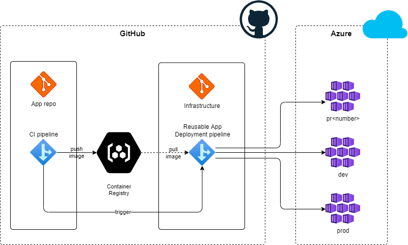
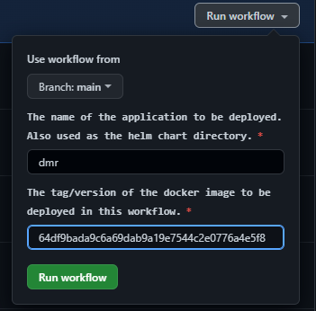

# Continuous Deployment Strategy for Applications

This document outlines a high level strategy and approach for Continuous Deployment pipelines across the whole Bürokratt system.

Continuous Deployment (CD) is the practice of automatically releasing changes from the (`main`) branch frequently and in doing so "continuously" ensuring that the code "integrates" well with other code.

By combining Continuous Integration and infrastructure as code (IaC), we're able to achieve identical deployments with the confidence to be able to deploy to production at any time. Continuous Deployment, allows us to automate the entire process from code commit to production if CI/CD tests and security checks pass.

## How does it work?

Each code repository has a CI pipeline which in turn calls a CD pipeline which sits inside the Infrastructure repository (see [workflows](https://github.com/buerokratt/Infrastructure/tree/main/.github/workflows)). The pipelines themselves will be the same but they will be published on each repository.

Here are the CI pipelines for each of our applications:
- [Mock-Bot](https://github.com/buerokratt/Mock-Bot/tree/main/.github/workflows/ci-build-publish-main.yml)
- [DMR](https://github.com/buerokratt/DMR/blob/main/.github/workflows/ci-build-publish-main.yml)
- [CentOps](https://github.com/buerokratt/CentOps/blob/main/.github/workflows/build-publish-main.yml)
- [Mock-Classifier](https://github.com/buerokratt/Mock-Classifier/blob/main/.github/workflows/ci-build-publish-main.yml)

The CD pipelines in these application code repositories are triggered automatically when changes are merged to `main`.  This initates the creation of docker containers which are signed and put onto GHCR (GitHub Container Registry).

The pipeline in the application repository then triggers the [cd-app-deployment](https://github.com/buerokratt/Infrastructure/blob/main/.github/workflows/cd-app-deployment.yml) pipeline inside the Infrastructure repo using the GitHub CLI's `gh workflow run` command.

## How can you trigger deployments manually?

Sometimes, you might want to deploy applications adhoc. For this you need to:
1. Navigate to [cd-app-deployment](https://github.com/buerokratt/Infrastructure/blob/main/.github/workflows/cd-app-deployment.yml) pipeline and select "Run workflow": \

2. Enter the name of the application package you want to deploy
3. Enter the tag/version of the application (at the moment, it is the same as the commit SHA)

Find the names and tags of the packages here: https://github.com/orgs/buerokratt/packages
